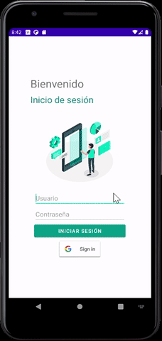

## Taller 2 Android

### Integrantes del grupo
- Luz Carime Lucumí Hernández (@lclucumi)
- Javier Alexis Orozco Manzano (@AlexisOrozcoM)
- Luis Eduardo Albarán Vélez (@luisalvaran17)

### Navegabilidad por los tres componentes y uso de IU

### Inicio de sesión por medio de consulta de un recurso API REST

### ConectyManager y NerworkInfo para redireccionar en caso de conectividad nula

### Autentificación por API de Google

